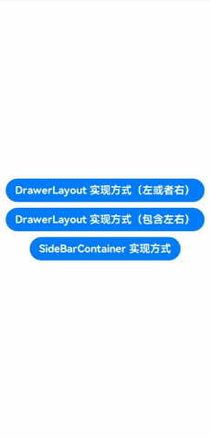

# DrawerLayout

## 简介
> DrawerLayout是基于HarmonyOS，ArkTS语言封装的抽屉（侧边栏）布局组件。
> （提供左右侧边栏可以显示和隐藏的侧边栏布局组件，通过子组件定义侧边栏和内容区。）


## 下载安装
> （备注：目前暂未上传到仓库，如需使用可以直接把DrawerLayout模块包中的DrawerLayout/src/main/ets/components/DrawerLayout.ets文件直接复制到对应工程代码中使用）^_^
```shell
ohpm install @smarthane/drawer-layout  
```

## 使用说明
1. 引入文件及代码依赖
 ```
    import { DrawerLayout } from '@smarthane/drawer-layout'
 ```
2. 使用步骤说明
 ```
   （1） 创建model
    @State model: DrawerLayout.Model = new DrawerLayout.Model()
   （2） 创建DrawerLayout
    DrawerLayout({
        // 1.绑定Model
        model: $model,
        // 2.侧边栏布局页面
        drawerView: () => {
          this.buildDrawerView();
        },
        // 3.内容布局页面
        contentView: () => {
          this.buildContentView();
        }
      })
   （3）model方法说明 
    //打开抽屉
    this.model.openDrawer()
    //关闭抽屉
    this.model.closeDrawer()
    //打开或者关闭抽屉
    this.model.openOrCloseDrawer()
 ```
3. 使用示例
 ```
    详细可以参考工程entry模块下面的示例代码。

    @Entry
    @Component
    struct DrawerLayoutPage {
      @State model: DrawerLayout.Model = new DrawerLayout.Model()
        // 设置左侧边栏DrawerLayout.Type.LEFT 还是右侧边栏DrawerLayout.Type.RIGHT【默认为左侧】
        .setDrawerType(DrawerLayout.Type.LEFT)
        // 设置侧边栏宽度【默认为260】
        .setDrawerWidth(230);
    
      // 用于判断手机的物理返回按钮
      onBackPress() {
        if (this.model.isDrawerOpen) {
          this.model.closeDrawer();
          return true;
        }
        return false;
      }
    
      build() {
        Column() {
          DrawerLayout({
            model: $model,
            drawerView: () => {
              this.buildDrawerView();
            },
            contentView: () => {
              this.buildContentView();
            }
          })
        }
        .height('100%')
      }
    
      @Builder buildContentView() {
        Column() {
          Text('这是内容项')
            .fontSize(30)
            .fontWeight(FontWeight.Bold)
    
          Button(this.model.isDrawerOpen ? '关闭侧边栏' : '打开侧边栏')
            .fontSize(20)
            .fontWeight(FontWeight.Bold)
            .margin({ top: 30 })
            .onClick(() => {
              this.model.openOrCloseDrawer();
            })
    
          Text(this.model.drawerType == DrawerLayout.Type.LEFT ? '当前为左侧边栏' : '当前为右侧边栏')
            .fontSize(20)
            .fontWeight(FontWeight.Bold)
            .margin({ top: 30 })
    
          Button(this.model.drawerType == DrawerLayout.Type.LEFT ? '切换为右侧边栏' : '切换为左侧边栏')
            .fontSize(20)
            .fontWeight(FontWeight.Bold)
            .margin({ top: 10 })
            .onClick(() => {
              this.model.setDrawerType(this.model.drawerType == DrawerLayout.Type.LEFT ?  DrawerLayout.Type.RIGHT : DrawerLayout.Type.LEFT)
            })
        }
        .justifyContent(FlexAlign.Center)
        .width('100%')
        .height('100%')
      }
    
      @Builder buildDrawerView() {
        Column() {
          if (this.model.drawerType == DrawerLayout.Type.LEFT) {
            Text('这是左边抽屉项\n1.可左右滑动\n2.点击遮罩层关闭')
              .fontSize(30)
              .fontWeight(FontWeight.Bold)
          } else {
            Text('这是右边抽屉项\n1.可左右滑动\n2.点击遮罩层关闭')
              .fontSize(30)
              .fontWeight(FontWeight.Bold)
          }
        }
        .backgroundColor(Color.Orange)
        .justifyContent(FlexAlign.Center)
        .width('100%')
        .height('100%')
      }
    }

 ```

## 接口说明
`@State DrawerLayout.Model = new DrawerLayout.Model();`
1. 设置侧边栏宽度【默认为260】`model.setDrawerWidth()`
2. 设置左、右侧边栏【默认为左侧】`model.setDrawerType()`
3. 打开抽屉`model.openDrawer()`
4. 关闭抽屉`model.closeDrawer()`
5. 打开或者关闭抽屉`model.openOrCloseDrawer()`

## 目录结构
````
|---- DrawerLayout
|     |---- entry  # 示例代码文件夹
|     |---- DrawerLayout  # DrawerLayout库文件夹
|           |---- index.ets  # 对外接口
|           |---- src
|                 |---- main
|                       |---- components
|                             |---- DrawerLayout.ets  # 自定义组件类
|     |---- README.md  # 安装使用方法                    
````

## 贡献代码
使用过程中发现任何问题都可以提 [Issue](https://gitee.com/smarthane/drawerlayout/issues) 给我们，当然，我们也非常欢迎你给我们发 [PR](https://gitee.com/openharmony-sig/material-dialogs/pulls) 。

## 开源协议
本项目基于 [ Apache License 2.0](https://gitee.com/smarthane/drawerlayout/blob/master/LICENSE) ，请自由地享受和参与开源。